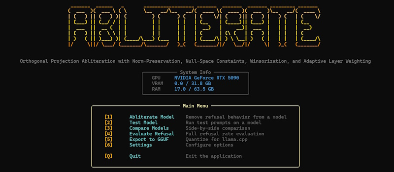

# Abliterator

### Orthogonal Projection Abliteration toolkit featuring Norm-Preservation, Null-Space Constaints, Winsorization, and Adaptive Layer Weighting



## Installation

This project uses [uv](https://docs.astral.sh/uv/) for dependency management.

```bash
# One-time: install uv
curl -LsSf https://astral.sh/uv/install.sh | sh

git clone https://github.com/RevivifAI/llm-derestrictor
cd llm-derestrictor
uv sync                 # runtime deps only
uv sync --group dev     # + dataset-build + pytest/black/ruff
```

This creates `.venv/` and installs the `derestrictor` entry point (the
`abliterate` alias is retained for backward compatibility). The pinned Python
version lives in `.python-version` (3.12).

## Requirements

- **Python 3.10+** with PyTorch
- **CUDA** (optional) — GPU acceleration for faster processing; falls back to CPU if unavailable
- **llama.cpp** (optional) — required for GGUF export; install separately from [github.com/ggerganov/llama.cpp](https://github.com/ggerganov/llama.cpp) and ensure `convert_hf_to_gguf.py` and `llama-quantize` are available

## Quick Start

```bash
uv run derestrictor
```

On first run, a setup wizard walks you through configuration—where your models live, output directories, and default precision. After that, you'll land in the main menu.

## Data

All prompts (harmful / harmless / preservation) live in the
[RevivifAI/derestriction](https://huggingface.co/datasets/RevivifAI/derestriction)
HuggingFace dataset, three aligned 10,000-row splits with a `{Prompt, Source}`
schema. They are loaded lazily by `derestrictor.data.loader.load_split` and
cached under `~/.cache/huggingface/datasets`; no local files are required.

The `harmful` split is pre-filtered to drop any prompt that mentions or targets
children (keyword regex + semantic similarity against child-harm anchors) — see
[`src/derestrictor/data/harm_filter.py`](src/derestrictor/data/harm_filter.py)
for details.

The dataset is the only prompt source — there is no local-file fallback or
override. Rebuild the dataset (and re-upload it) if you need different content.

To rebuild or re-upload the dataset:

```bash
uv run python -m derestrictor.scripts.build_dataset
uv run python -m derestrictor.scripts.upload_dataset
```

The upload script requires `HF_TOKEN` in `.env` (or the environment) with write
access to the `RevivifAI` org.

## Using the CLI

### Abliterate Model

The main workflow. Select a model from discovered directories (or enter a path manually), configure your options, and let it run.

**Step 1: Select Base Model**
The CLI scans your configured directories and shows available models. Already-abliterated models are marked with `[A]`.

**Step 2: Output Path**
Defaults to `./abliterate/abliterated_models/{model-name}-abliterated`. Change it if you like.

**Step 3: Configuration**
- **Number of prompts**: How many harmful/harmless pairs to use (default: 30)
- **Direction multiplier**: Ablation strength—1.0 is full, lower values are gentler
- **Norm preservation**: Keeps weight magnitudes stable (recommended)
- **Filter prompts by refusal**: Only uses prompts the model actually refuses (recommended)
- **Precision**: float16 is fastest, bfloat16 for better precision

**Step 4: Advanced Options**
Optional enhancements for better results:

| Option | What it does | When to use |
|--------|--------------|-------------|
| **Winsorization** | Clips outlier activations before computing directions | Gemma models, or when baseline gives weak results |
| **Null-space constraints** | Preserves model capabilities (math, coding, reasoning) | When you want minimal capability degradation |
| **Adaptive layer weighting** | Focuses ablation on middle-to-later layers | For targeted, surgical ablation |

### Test Model

Quick sanity checks:
- **Quick test**: 5 default prompts with refusal detection
- **Custom prompt**: Enter anything and see how the model responds
- **Full evaluation**: Statistical analysis (see below)

### Compare Models

Load an original and abliterated model side-by-side, enter a prompt, and see both responses. Useful for spot-checking behavior changes.

### Evaluate Refusal

Runs the model against harmful and harmless prompt sets, computing refusal rates for each. Results are saved as timestamped JSON files to your configured eval directory.

- **Harmful refusal rate**: Lower = more abliterated
- **Harmless refusal rate**: Lower = fewer false positives

### Export to GGUF

Converts abliterated models to GGUF format for llama.cpp, Ollama, or LM Studio. Supports Q4_K_M, Q5_K_M, Q8_0, and F16 quantization types. Vision-language models get automatic mmproj export.

### Settings

Manage model search directories, eval output location, llama.cpp path, and
defaults. The **Manage prompts** entry shows the row counts of each
`RevivifAI/derestriction` split and lets you force-refresh the local HF cache.

---

## The Math

### Refusal Direction Extraction

Based on [Arditi et al. (2024)](https://arxiv.org/abs/2406.11717), refusal behavior is mediated by a single direction in activation space.

1. Run the model on harmful prompts, extract hidden states from middle layers
2. Run the model on harmless prompts, extract hidden states
3. Refusal direction **d** = mean(harmful) − mean(harmless), normalized

### Orthogonal Projection

Following [Lai's norm-preserving method](https://huggingface.co/blog/grimjim/norm-preserving-biprojected-abliteration), we remove the refusal component from weight matrices:

$$W_{proj} = W - (W \cdot d) \otimes d^T$$

This projects out the component of each weight row that aligns with the refusal direction.

### Norm Preservation

Continuing [Lai's norm-preserving method](https://huggingface.co/blog/grimjim/norm-preserving-biprojected-abliteration), to maintain activation magnitudes, we rescale:

$$W_{final} = W_{proj} \times \frac{\|W\|_F}{\|W_{proj}\|_F}$$

This keeps the Frobenius norm unchanged, preventing downstream instabilities.

### Winsorization

For models with outlier activations (especially Gemma), we clip extreme values before direction computation:

$$\text{threshold} = \text{quantile}(|x|, 0.995)$$
$$x_{clipped} = \text{clamp}(x, -\text{threshold}, \text{threshold})$$

### Null-Space Constraints

Adapted from [AlphaEdit (Fang et al., ICLR 2025)](https://arxiv.org/abs/2410.02355). To preserve capabilities, we project the ablation update into the null space of preservation activations:

1. Collect activations **K** from diverse capability prompts (math, coding, reasoning)
2. Compute SVD: **U, S, V** = SVD(**K**)
3. Build null-space projector: **P**_null = **I** − **VV**^T
4. Constrain update: Δ**W**_constrained = Δ**W** · **P**_null

This mathematically guarantees the update won't affect outputs for preserved prompts.

### Adaptive Layer Weighting

Research shows refusal concentrates in middle-to-later layers. We apply Gaussian-weighted strength:

$$\text{weight}_i = \exp\left(-\frac{1}{2}\left(\frac{i - \mu}{\sigma}\right)^2\right)$$

Where μ = 60% of model depth and σ = 20% of layers.

---

## References

Archived copies of each reference live in [`docs/papers/`](docs/papers/) so the
repo is usable offline and immune to link rot.

**Core Research**
- [Refusal in Language Models Is Mediated by a Single Direction](https://arxiv.org/abs/2406.11717) — Arditi et al. (2024) ([local PDF](docs/papers/arditi-2024-refusal-direction.pdf))
- [Representation Engineering](https://arxiv.org/abs/2310.01405) — Zou et al. (2023) ([local PDF](docs/papers/zou-2023-representation-engineering.pdf))

**Techniques**
- [Norm-Preserving Biprojected Abliteration](https://huggingface.co/blog/grimjim/norm-preserving-biprojected-abliteration) — Jim Lai ([local snapshot](docs/papers/lai-2024-norm-preserving-biprojected-abliteration.md))
- [AlphaEdit: Null-Space Constrained Knowledge Editing](https://arxiv.org/abs/2410.02355) — Fang et al. (ICLR 2025) ([local PDF](docs/papers/fang-2025-alphaedit.pdf))

---

## License

[MIT](./LICENSE)
